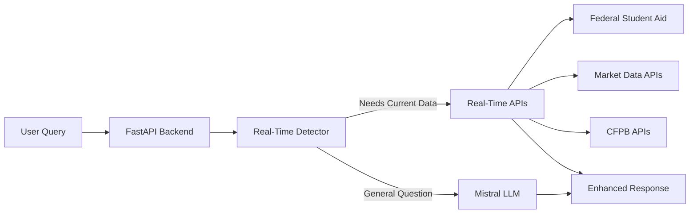

# Real-Time Financial API Integration Guide

## Overview

pgpfinlitbot now uses real-time financial APIs to provide current, authoritative information to students. This replaces the previous RAG (Retrieval-Augmented Generation) system with direct API calls to trusted financial data sources.

## Architecture



## How It Works

### 1. Query Analysis
The system analyzes incoming queries for keywords that indicate a need for real-time data:
- "current", "today", "latest", "recent", "now"
- "2024", "2025", "interest rates", "updates"
- "news", "policy changes"

### 2. API Selection
Based on the query content, the system selects appropriate APIs:

#### Federal Student Aid API
Triggered by: "student loan", "federal loan", "aid", "pell grant"
Provides:
- Current interest rates
- Loan forgiveness programs
- Federal aid information

#### Financial Market APIs
Triggered by: "interest rate", "rate", "economy", "inflation"
Provides:
- Federal funds rate
- Savings account rates
- CD rates
- Mortgage rates

#### CFPB API
Triggered by: "credit", "bank", "consumer", "protection"
Provides:
- Consumer rights information
- Banking regulations
- Credit protection guidelines

### 3. Response Integration
Real-time data is injected into the LLM prompt with clear source attribution, ensuring responses include:
- Current, accurate information
- Proper source citations
- Date of information

## Adding New API Sources

To add a new real-time data source:

1. **Create API Function**
```python
async def fetch_new_source_info(query: str) -> Optional[str]:
    """Fetch information from New Source API"""
    try:
        # API integration logic here
        if "trigger_keyword" in query.lower():
            return """Current Information:
            - Data point 1
            - Data point 2
            
            Source: Official Source Name
            Updated: Date"""
        return None
    except Exception as e:
        print(f"❌ New Source API error: {e}")
        return None
```

2. **Add to Main Fetcher**
Update `fetch_realtime_info()` in `backend/app/main.py`:
```python
# New Source API
if any(term in query_lower for term in ["keyword1", "keyword2"]):
    new_info = await fetch_new_source_info(query)
    if new_info:
        context_parts.append(f"NEW SOURCE INFORMATION:\n{new_info}")
```

3. **Test Integration**
```bash
curl "http://localhost:8080/test/realtime?query=your_test_query"
```

## API Configuration

### Environment Variables
Add any API keys or endpoints to docker-compose.yml:
```yaml
environment:
  - NEW_API_KEY=${NEW_API_KEY}
  - NEW_API_URL=https://api.example.com
```

### Rate Limiting
Current implementation includes basic rate limiting. For production:
- Implement per-API rate limits
- Add caching for frequently requested data
- Use Redis for distributed rate limiting

## Troubleshooting

### API Timeout Issues
- Default timeout: 30 seconds
- Adjust in `httpx.AsyncClient(timeout=30.0)`
- Consider implementing retry logic

### Missing Data
- Check API keyword triggers
- Verify API endpoints are accessible
- Review API response format

### Performance Issues
- Enable caching for static data
- Implement parallel API calls
- Use connection pooling

## Best Practices

1. **Always Cite Sources**: Include source name and date
2. **Graceful Degradation**: Fall back to LLM knowledge if APIs fail
3. **Cache Wisely**: Cache stable data (rates) for 5-15 minutes
4. **Monitor Usage**: Track API calls and response times
5. **Version APIs**: Use versioned endpoints when available

## Future Enhancements

1. **Production APIs**
   - Federal Student Aid official API
   - Alpha Vantage for market data
   - CFPB complaint database API

2. **Advanced Features**
   - Webhook support for real-time updates
   - GraphQL integration for efficient queries
   - Multi-source data aggregation

3. **Performance**
   - Redis caching layer
   - CDN for static financial data
   - Async batch processing

## Security Considerations

1. **API Key Management**
   - Use environment variables
   - Rotate keys regularly
   - Never commit keys to version control

2. **Input Validation**
   - Sanitize user queries
   - Prevent injection attacks
   - Validate API responses

3. **Data Privacy**
   - Don't store personal financial data
   - Use HTTPS for all API calls
   - Implement audit logging

---

For questions or contributions, please refer to the main README.md file. 